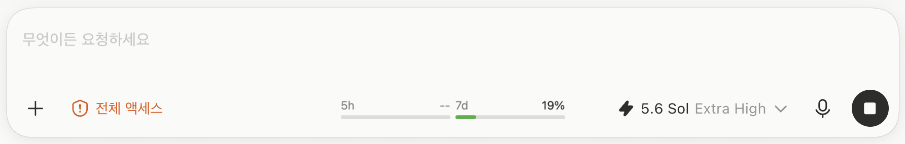

# CodexUsageOverlay

Codex 데스크톱 앱의 실제 채팅 입력창 위에 5시간/7일 사용량 BAR를 표시하는 macOS
오버레이입니다.

> 비공식 개인 프로젝트로 OpenAI와 무관합니다(Not affiliated with or endorsed by
> OpenAI). "OpenAI"·"ChatGPT"·"Codex"는 각 권리자의 상표입니다. 자세한 조건은
> [LICENSE](LICENSE)를 참고하세요.



- Codex 앱 자체는 수정하지 않습니다. 별도 백그라운드 앱의 투명한 `NSPanel`을 위에
  겹쳐 그립니다.
- 데이터는 `~/.codex/sessions`의 로컬 `token_count` 이벤트만 읽습니다. 네트워크 요청,
  쿠키, 토큰, 브라우저 인증 정보에는 접근하지 않습니다.
- Codex가 제공하는 300분 창은 `5h`, 10,080분 창은 `7d`로 표시합니다.
- BAR 색상은 사용량에 따라 초록 → 노랑 → 빨강으로 바뀝니다(기본 70% / 90%).
- 입력창의 가로 중앙을 유지하면서, 세로 중심은 오른쪽 모델 선택 컨트롤의 실제 중심선에
  맞춥니다.
- 창 이동·리사이즈, 우측 보조 창 너비 변경, 입력창 한 줄/여러 줄 전환을 자동 추적합니다.
- Codex가 맨 앞 앱일 때만 표시되고, 모든 마우스 클릭은 아래 입력창으로 통과합니다.
- 실제 입력 글자나 툴바 컨트롤과 겹칠 때는 잠시 숨겨 기존 UI를 가리지 않습니다.

## 요구사항

- macOS 14 이상
- Xcode Command Line Tools (`swift build`가 실행되면 충분)
- Codex 데스크톱 앱

Command Line Tools가 없다면:

```bash
xcode-select --install
```

## 빌드 및 실행

```bash
git clone https://github.com/5Donghwan/codex-usage-overlay.git
cd codex-usage-overlay
chmod +x build.sh test.sh
./build.sh
open dist/CodexUsageOverlay.app
```

첫 실행 시 접근성 권한을 허용해야 합니다.

1. 시스템 설정 → 개인정보 보호 및 보안 → 손쉬운 사용으로 이동합니다.
2. `CodexUsageOverlay`를 켭니다.
3. 이미 켜져 있는데 표시되지 않으면 스위치를 껐다가 다시 켭니다.

권한이 적용되면 재시작 없이 몇 초 안에 입력창 추적을 시작합니다. 앱은 Dock이나 메뉴
막대에 표시되지 않는 백그라운드 액세서리 앱입니다.

> **주의:** 개발용 앱은 ad-hoc 서명을 사용합니다. 소스를 다시 빌드하면 macOS가 새
> 실행 파일로 판단해 접근성 권한을 다시 켜야 할 수 있습니다. 배치·크기·색상 임계값은
> 가능한 한 `tunables.json`에서 조정하세요. 재빌드 없이 약 2초 안에 반영됩니다.

## 기본 표시 규격

- 전체 크기: 약 **221 × 30pt**
- 시각 배율: **95%**
- BAR 길이: 각각 **108pt**
- BAR 간격: **5pt**
- 서체: macOS system UI regular
- 가로 위치: 실제 입력창 컨테이너의 중앙
- 세로 위치: 현재 모델 선택 컨트롤의 중심선
- 모델 컨트롤을 일시적으로 읽지 못하면 입력창 하단 기준 **32pt** 오프셋을 사용

각 제목은 BAR 왼쪽 끝, 수치는 BAR 오른쪽 끝에 맞춰집니다.

## 실시간 미세 조정

프로젝트 루트의 [tunables.json](tunables.json)을 수정하면 실행 중인 앱이 약 2초 안에
다시 읽습니다. 일부 필드만 남겨도 나머지는 코드 기본값을 사용합니다.

| 필드 | 기본값 | 설명 |
|---|---:|---|
| `barW` | `113.6842105` | 95% 배율 전 BAR 길이. 실제 표시 길이는 108pt |
| `groupGap` | `5.2631579` | 95% 배율 전 두 그룹 사이 간격 |
| `panelH` | `30` | 오버레이 패널 높이 |
| `sidePad` | `0` | 좌우 내부 여백 |
| `scale` | `0.95` | 전체 시각 배율 |
| `centerAboveBottom` | `32` | 모델 컨트롤 탐지 실패 시 사용하는 세로 중심 오프셋 |
| `titleSize` | `12` | `5h` / `7d` 제목 크기 |
| `valueSize` | `12` | 퍼센트 수치 크기 |
| `barHeight` | `4` | BAR 두께 |
| `labelBarGap` | `3` | 라벨 행과 BAR 사이 간격 |
| `warnAt` | `70` | 이 값 이상이면 노란색 |
| `dangerAt` | `90` | 이 값 이상이면 빨간색 |
| `appearance` | `system` | `system`, `light`, `dark` 중 하나 |
| `hideOnOverlap` | `true` | 글자나 컨트롤과 겹치면 숨김 |
| `overlapMargin` | `8` | 겹침 판정 좌우 여유 |

예를 들어 경고 색상을 더 늦게 표시하려면:

```json
{
  "warnAt": 80,
  "dangerAt": 95
}
```

## 위치 추적 방식

Codex의 접근성(AX) 트리에서 실제 입력 영역과 컴포저 컨테이너를 찾습니다. 오버레이의
가로 중심은 컴포저 중심을 사용하고, 세로 중심은 오른쪽 툴바의 모델 선택
`AXPopUpButton` 중심을 직접 사용합니다.

따라서 아래 변화가 생겨도 같은 상대 위치를 유지합니다.

- Codex 창 이동·확대·축소
- 다른 모니터로 창 이동
- 오른쪽 보조 패널 열기·닫기·너비 조절
- 입력창 한 줄 ↔ 여러 줄 전환
- 모델명이나 effort 표시 길이에 따른 모델 컨트롤 너비 변화

모델 선택 컨트롤을 일시적으로 찾지 못하는 접근성 트리 갱신 순간에는 기존 32pt
컴포저 기준값으로 안전하게 폴백합니다.

## 겹침 회피

오버레이가 차지할 영역과 다음 접근성 프레임을 교차 검사합니다.

- 전체 액세스·모델 선택·마이크·전송 버튼 등 실제 툴바 컨트롤
- 입력창에 작성된 실제 텍스트 경계
- 빈 입력창의 왼쪽 플레이스홀더 영역

긴 입력문이 중앙까지 오면 오버레이를 숨기고, 중앙이 다시 비면 자동으로 표시합니다.
접근성 값 읽기에 실패한 순간에는 글자를 가리지 않도록 보수적으로 숨깁니다.

겹침 여부는 로그에서 확인할 수 있습니다.

```bash
grep -E "hidden|shown" ~/Library/Logs/CodexUsageOverlay.log
```

항상 표시하고 싶다면 아래처럼 바꿀 수 있지만 입력 글자나 컨트롤을 가릴 수 있습니다.

```json
{ "hideOnOverlap": false }
```

## 사용량 색상

두 BAR는 각자의 사용량을 독립적으로 평가합니다.

| 구간 | 색 | 값 |
|---|---|---|
| `< warnAt` (기본 0–69%) | 초록 | `#43B03F` |
| `>= warnAt` (기본 70–89%) | 노랑 | `#FFCC00` |
| `>= dangerAt` (기본 90–100%) | 빨강 | `#FF453A` |
| 데이터 없음 | 중립 트랙 + `--` | 시스템 색상 |

임계값은 `tunables.json`의 `warnAt`과 `dangerAt`으로 바꿀 수 있습니다.

## 데이터와 개인정보

이 앱은 `~/.codex/sessions/YYYY/MM/DD/*.jsonl`의 끝부분에서 최신
`payload.type == "token_count"` 이벤트를 찾습니다.

- `window_minutes`가 약 300분이면 `5h`
- `window_minutes`가 약 10,080분이면 `7d`
- `limit_id`가 있으면 `codex` 이벤트만 사용
- 만료 시각이 지났으면 해당 사용량을 0%로 처리
- 최근 8일 범위만 확인하고 파일마다 최대 약 2MB의 끝부분만 읽음

읽기 전용이며 외부 API 요청, 웹 스크래핑, 브라우저 쿠키, OpenAI 인증 토큰 접근은
없습니다. 현재 플랜이나 모델에서 특정 창을 제공하지 않으면 `--`로 표시합니다.

## 검증 및 진단

전체 회귀 검사와 현재 배치 확인:

```bash
./test.sh
```

개별 명령:

```bash
# 로컬 사용량 확인
swift run CodexUsageOverlay --print-usage

# 입력창·모델 선택기·오버레이 좌표와 충돌 상태 확인
dist/CodexUsageOverlay.app/Contents/MacOS/CodexUsageOverlay --inspect-placement

# Codex 접근성 트리 확인
dist/CodexUsageOverlay.app/Contents/MacOS/CodexUsageOverlay --probe

# 독립 렌더 미리보기
swift run CodexUsageOverlay --render-preview /tmp/overlay-light.png
swift run CodexUsageOverlay --render-preview /tmp/overlay-dark.png --dark
```

로그 위치:

```text
~/Library/Logs/CodexUsageOverlay.log
```

## 종료 및 삭제

실행 중인 오버레이 종료:

```bash
pkill -f '/CodexUsageOverlay.app/Contents/MacOS/CodexUsageOverlay$'
```

삭제하려면 오버레이를 종료한 뒤 이 프로젝트 폴더를 지우고, 시스템 설정의 손쉬운 사용
목록에서 `CodexUsageOverlay` 항목을 제거하면 됩니다.

## 프로젝트 구조

```text
Sources/CodexUsageOverlay/
  AX.swift           접근성 트리 탐색, 입력창·모델 선택기 추적, 충돌 판정
  OverlayUI.swift    SwiftUI BAR와 투명 NSPanel
  Palette.swift      사용량 단계별 의미 색상
  UsageStore.swift   로컬 세션 사용량 파싱과 실시간 설정
  SelfTest.swift     배치·충돌·파싱 회귀 검사
  main.swift         CLI 진단 명령과 앱 진입점
Resources/Info.plist 백그라운드 앱 번들 설정
```

## 제한사항

- Codex의 비공개 접근성 트리 구조가 크게 바뀌면 입력창 탐지 휴리스틱을 조정해야 할 수
  있습니다.
- 사용량 표시는 로컬 세션 이벤트가 제공하는 값에 의존합니다. 이벤트가 아직 없거나 해당
  창이 제공되지 않으면 `--`가 정상입니다.
- Codex가 전면 앱이 아닐 때는 의도적으로 표시하지 않습니다.

## 라이선스

[MIT License](LICENSE). Codex/OpenAI 제품명과 UI에 대한 권리는 포함하지 않습니다.
